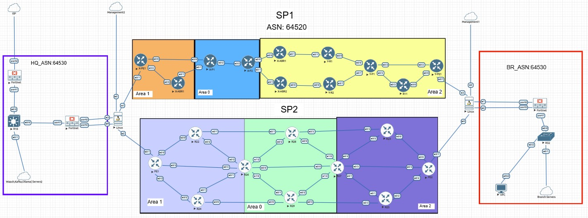
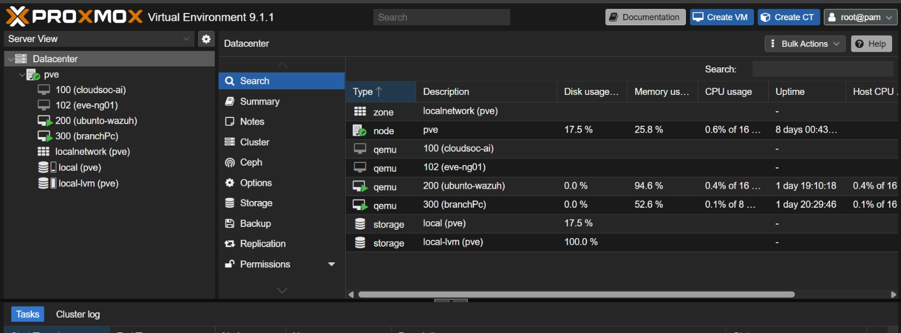

# CloudSOC-AI — Network Infrastructure & Security Layer

Network security infrastructure project featuring a dual-ISP backbone (OSPF/MPLS/BGP), FortiGate SD-WAN, and Wazuh SIEM integration for centralized threat detection and security event processing.

## Overview

This project simulates an enterprise network security architecture connecting a Headquarters (HQ) site and a Branch site through two independent service providers, with automated failover, VPN encryption, and centralized security monitoring.

## Architecture

The topology includes:
- **Dual-ISP backbone** (SP1/SP2) with OSPF multi-area design (Area 0/1/2)
- **iBGP Route Reflectors** and eBGP multi-homing between HQ and SP networks
- **FortiGate NGFW** at HQ and Branch edges for perimeter security
- **Centralized Wazuh, Kafka, and Ollama servers** at HQ for log processing and threat detection

## Lab Environment

The lab was built using Proxmox VE for virtualization, with EVE-NG for network emulation, an Ubuntu-based Wazuh SIEM server, and a Branch PC for connectivity and failover testing.

## Demo: SD-WAN Failover

https://github.com/user-attachments/assets/sdwan-failover-demo.mp4

Demonstration of FortiGate SD-WAN SLA-based failover between the two ISP links, tested under simulated WAN degradation using `tc netem`.

*(If the video above doesn't render, [watch it directly here](sdwan-failover-demo.mp4).)*

## Key Features

- Dual-ISP backbone with OSPF/MPLS/LDP and iBGP Route Reflectors, resolving production routing challenges (RPF violations, asymmetric routing)
- FortiGate SD-WAN with IPsec VPN and SLA-based failover
- WAN emulation (`tc netem`) for resiliency testing
- Wazuh SIEM integration with alert normalization, deduplication, and Kafka streaming for centralized security event processing

## Tech Stack

`OSPF` `MPLS` `BGP` `FortiGate NGFW` `SD-WAN` `IPsec VPN` `Wazuh SIEM` `Apache Kafka` `Proxmox` `EVE-NG` `Linux`

## Author

**Ismail Mabchour** — Cybersecurity & Cloud Computing Engineering Student, ENSAM Casablanca
[LinkedIn](www.linkedin.com/in/ismail-mabchour/) · mabchour.ismail@ensam-casa.ma
